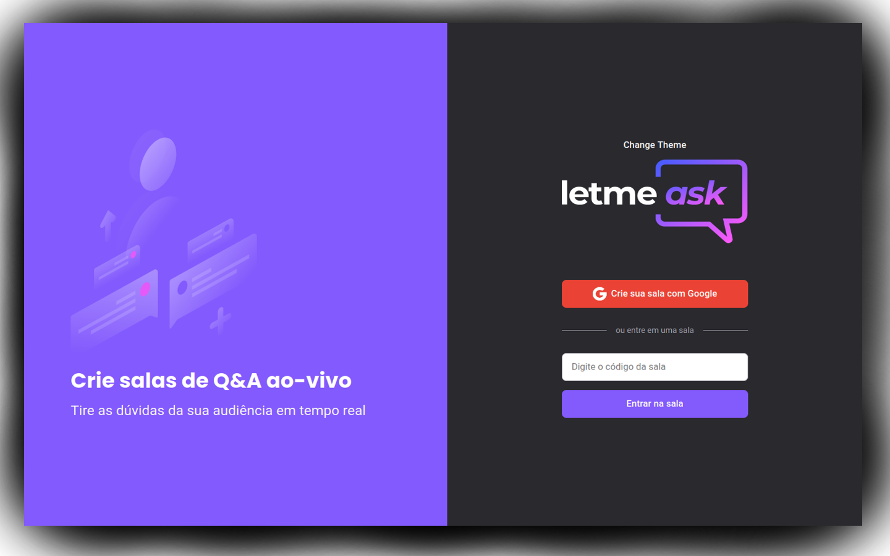

# LETMEASK

<p align="center" shadow="8px">
  
</p>

## Description

<p align="justify">
  Letmeask is a room management app, whose functionality is to send or receive questions, participating or been a owner of a room whose creator can see and answer questions based on likes, thus choosing the questions in order of request. All the project was made by other person, I was just following him, the link for the event were project was made is <a href="https://app.rocketseat.com.br/node/mission-react-js" >here</a>.
</p>

### Technologies

1. <a href="https://nodejs.org/" >Node</a>
2. <a href="https://reactjs.org/">React</a>
3. <a href="https://firebase.google.com/">Firebase</a>
4. <a href="https://styled-components.com/">Styled-components</a>

### Running project

<p align="justify">I used yarn for the entire project, if you prefer to use npm, please note that the tutorial below might be not the best way to make project work, so search about how install dependencies with npm and run scripts.</p>

```bash
# Clone the git repository
$ git clone <https://github.com/datsfilipe/letmeask-react-app.git>

# Enter the folder created by git clone
$ cd letmeask-react-app

# Install dependencies with yarn
$ yarn

# Run app in development mode
$ yarn start

# Server will be listening on port 3000
```
### Observations

1. Theme context is complete, but: image logo is not in context, that's one thing to do;

2. Also the button to toggle theme is not styled, which is another thing to do.
